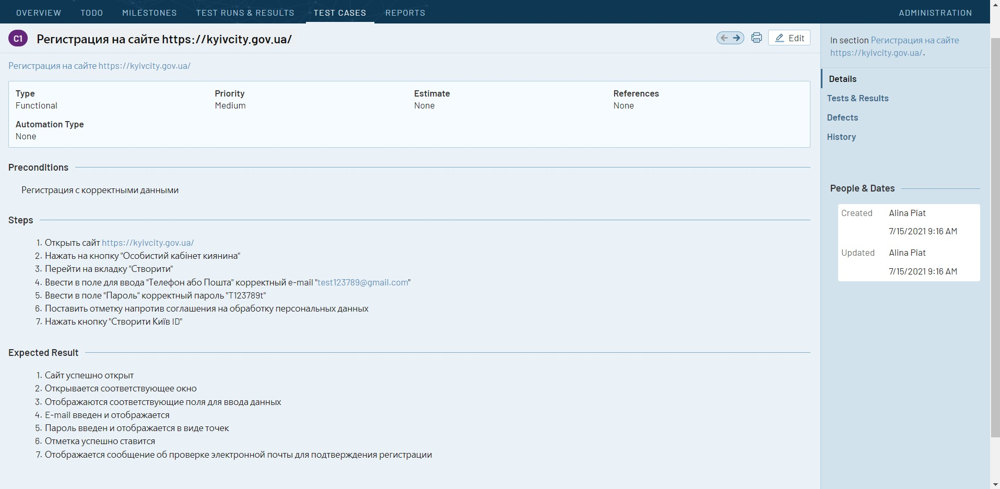
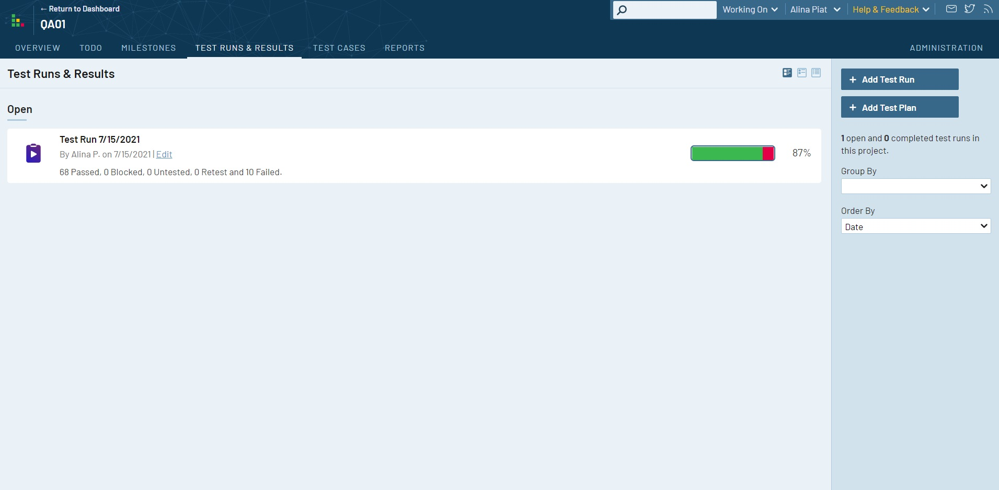
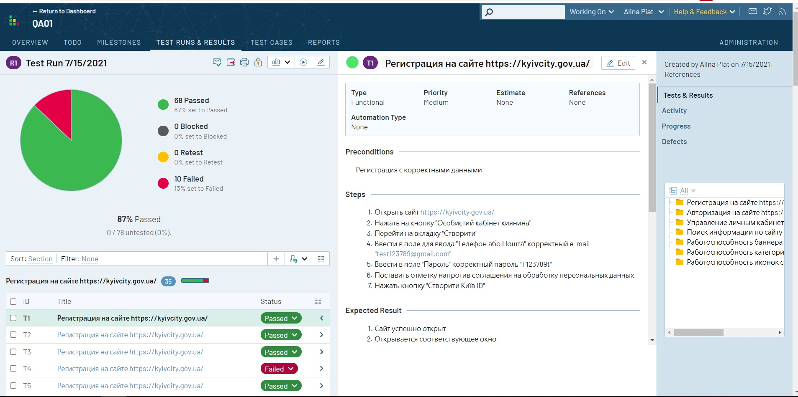

#My test volunteering

##screenshots of the kyivcity.gov.ua website  testing

toggle Screenshot :clapper:

 

 

toggle Screenshot :clapper:

 

 

toggle Screenshot :clapper:

 

 

toggle Screenshot :clapper:

 

 

toggle Screenshot :clapper:

 

 
full screen could be checked in this [repo](https://github.com/alinapiatyhor/Testrail/tree/main/screens) 